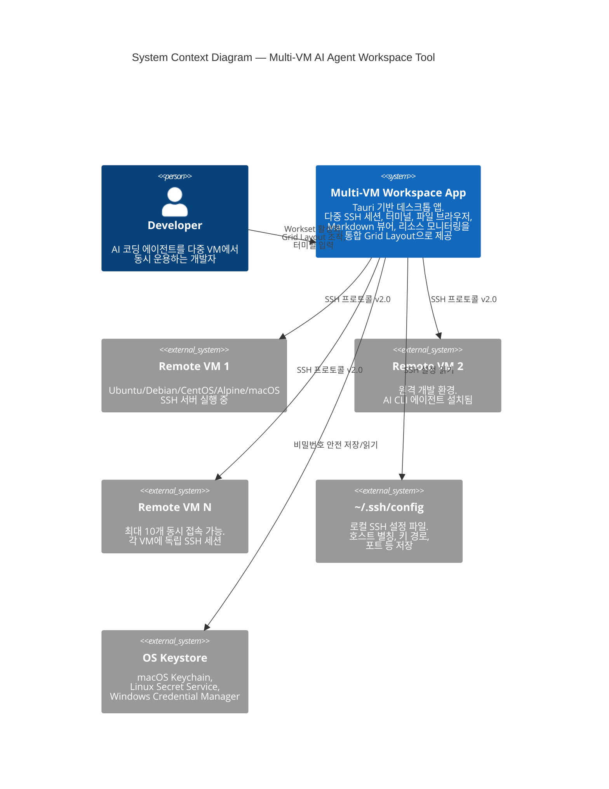
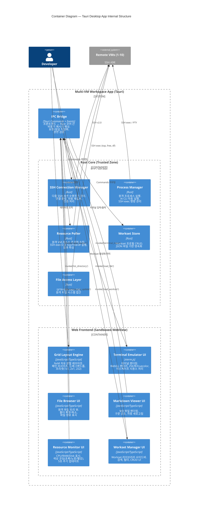

# Architecture Blueprint — Multi-VM AI Agent Workspace Tool

## Document Information

| Field | Value |
|-------|-------|
| **Document Type** | Architecture Blueprint |
| **Version** | 1.0 |
| **Date** | 2026-02-07 |
| **Status** | Draft |
| **Related Documents** | [Glossary](./glossary.md), [PRD](./prd.md), [Market Research](./market-research.md) |

---

## Executive Summary

이 문서는 Multi-VM AI Agent Workspace Tool의 소프트웨어 아키텍처를 정의한다. C4 모델을 기반으로 시스템 컨텍스트(Level 1)와 컨테이너(Level 2) 수준의 아키텍처를 설명하고, 핵심 컴포넌트의 책임과 인터페이스를 정의하며, 기술 리스크와 완화 전략, 그리고 주요 아키텍처 결정 기록(ADR)을 포함한다.

**핵심 아키텍처 방향**:
- **Tauri 기반 데스크톱 앱**: Rust 코어(신뢰 영역) + Web Frontend(비신뢰 영역) + IPC Bridge
- **SSH 연결은 Rust 코어에서 관리**: 보안과 성능을 위해 Rust에서 직접 SSH 프로토콜 처리
- **터미널 렌더링은 Web Frontend에서 xterm.js 활용**: WebGL 렌더러로 고성능 터미널 에뮬레이션
- **비동기 메시지 패싱 기반 IPC**: Tauri Commands와 Events를 통한 프론트엔드-백엔드 통신

---

## System Context Diagram (C4 Level 1)

시스템 컨텍스트 다이어그램은 Multi-VM AI Agent Workspace Tool이 외부 시스템 및 사용자와 어떻게 상호작용하는지를 보여준다.

<!-- CONTEXT: C4 Level 1 — 시스템의 외부 경계와 상호작용을 정의. 사용자(개발자)가 Desktop App을 통해 여러 Remote VM에 SSH로 접속하여 AI CLI 에이전트를 운용하는 전체 구조. -->

**핵심 관계 설명**:

| 관계 | 프로토콜 | 설명 |
|------|----------|------|
| Developer → Desktop App | 로컬 UI | Workset 프로필 관리, Grid Layout 조작, 터미널 상호작용 |
| Desktop App → Remote VM | SSH v2.0 | 다중 SSH 세션 (최대 10개 동시), 터미널 I/O, SFTP/SSH exec |
| Desktop App → ~/.ssh/config | 파일 읽기 | 호스트 별칭, 인증 키 경로, 포트 설정 자동 인식 |
| Desktop App → OS Keystore | OS API | SSH 비밀번호의 안전한 저장 및 조회 (NFR-13) |

Sources:
- Tauri IPC Architecture: [Tauri v2 IPC Documentation](https://v2.tauri.app/concept/inter-process-communication/)
- SSH Protocol: [RFC 4253 — SSH Transport Layer Protocol](https://tools.ietf.org/html/rfc4253)

---

## Container Diagram (C4 Level 2)

컨테이너 다이어그램은 Desktop App 내부의 주요 구성 요소를 보여준다. Tauri 앱은 크게 **Rust Core** (신뢰 영역), **Web Frontend** (비신뢰 영역), **IPC Bridge** (통신 계층) 세 영역으로 나뉜다.

<!-- CONTEXT: C4 Level 2 — Tauri 앱 내부 구조. Rust Core는 시스템 리소스 접근 권한을 가진 신뢰 영역이고, Web Frontend는 샌드박스된 WebView에서 UI를 담당. IPC Bridge가 두 영역 사이의 비동기 메시지 패싱을 중개. -->

**통신 흐름 예시 — Workset 활성화**:

1. Developer가 Workset Manager UI에서 Workset을 클릭
2. Web Frontend가 `invoke('activate_workset', { worksetId })` 호출
3. IPC Bridge가 요청을 Rust Core로 전달
4. Workset Store가 JSON에서 프로필 로드
5. SSH Connection Manager가 각 VM에 SSH 연결 수립
6. Process Manager가 각 VM에서 `cd <project_folder> && <ai_cli_command>` 실행
7. Resource Poller가 각 VM 리소스 수집 시작
8. Rust Core가 Events를 통해 Frontend에 연결 상태, 터미널 출력, 리소스 데이터를 스트리밍
9. Grid Layout Engine이 설정된 NxM 레이아웃으로 패인 배치

Sources:
- Tauri v2 Architecture: [Tauri v2 Concepts](https://v2.tauri.app/concept/inter-process-communication/)
- Tauri Trust Boundaries: [Kawaldeep Singh — Tauri 2.0 Architecture Fundamentals (2025)](https://medium.com/@kawaldeepsingh/tauri-2-0-building-lightweight-desktop-mobile-apps-with-rust-security-and-system-webview-c89e2901208a)

---

## Core Component Definitions

각 핵심 컴포넌트의 책임, 인터페이스, 의존 관계를 정의한다.

<!-- CONTEXT: 7개 이상의 핵심 컴포넌트 정의. PRD의 MUST 기능 요구사항과 1:1 매핑. 각 컴포넌트는 단일 책임 원칙을 따르며, IPC Bridge를 통해서만 다른 영역과 통신. -->

### SSH Connection Manager

**영역**: Rust Core (Trusted Zone)

**책임**:
- 다중 SSH 세션(최대 10개 동시)의 수명주기 관리 (연결, 유지, 종료)
- SSH 인증: 키 기반, 비밀번호, `~/.ssh/config` 파일 파싱 및 적용
- 연결 풀링: 하나의 VM에 대해 터미널, 파일 접근, 리소스 폴링이 SSH 채널을 공유
- 자동 재접속: 연결 끊김 감지 → 최대 3회, 5초 간격 재시도 (NFR-8)
- 연결 상태 이벤트 발행 (Connected, Disconnected, Reconnecting, Error)

**인터페이스**:

| 방향 | 타입 | 이름 | 설명 |
|------|------|------|------|
| 인바운드 | Command | `connect_ssh` | SSH 연결 수립 요청 |
| 인바운드 | Command | `disconnect_ssh` | SSH 연결 종료 요청 |
| 아웃바운드 | Event | `ssh_state_changed` | 연결 상태 변경 알림 |
| 아웃바운드 | 내부 | SSH 채널 제공 | Terminal Emulator, Resource Poller, File Access에 채널 배분 |

**PRD 매핑**: MUST-2 (SSH Connection Management)

Sources:
- SSH Connection Multiplexing: [RFC 4254 — SSH Connection Protocol](https://tools.ietf.org/html/rfc4254)
- Tabby SSH Architecture: [Tabby GitHub — SSH2 기반 멀티세션 관리](https://github.com/Eugeny/tabby)

---

### Terminal Emulator

**영역**: Web Frontend (xterm.js) + Rust Core (PTY 프록시)

**책임**:
- **프론트엔드 (xterm.js)**: 터미널 UI 렌더링, 사용자 키 입력 캡처, 256색/truecolor/이스케이프 시퀀스 처리
- **백엔드 (Rust)**: SSH 채널을 통한 PTY 연결, 터미널 I/O 스트리밍
- 10,000라인 스크롤백 버퍼 (NFR-2)
- Copy/Paste 지원 (Ctrl+Shift+C/V)
- WebGL 렌더러를 기본으로 사용하여 대량 출력 시 성능 확보

**인터페이스**:

| 방향 | 타입 | 이름 | 설명 |
|------|------|------|------|
| 인바운드 (FE) | 사용자 입력 | 키보드 이벤트 | 개발자의 터미널 입력 |
| 인바운드 (BE) | Event | `terminal_output` | Rust에서 스트리밍되는 PTY 출력 데이터 |
| 아웃바운드 (FE→BE) | Command | `terminal_input` | 사용자 키 입력을 Rust Core로 전달 |
| 아웃바운드 (FE→BE) | Command | `terminal_resize` | 터미널 크기 변경 알림 |

**PRD 매핑**: MUST-3 (Terminal Emulator)

Sources:
- xterm.js WebGL Renderer: [xterm.js Official](https://xtermjs.org/)
- xterm.js Performance Issue: [xtermjs/xterm.js #4135 — FPS Capping During Data Flood](https://github.com/xtermjs/xterm.js/issues/4135)
- Wave Terminal xterm.js Usage: [Wave Terminal GitHub](https://github.com/wavetermdev/waveterm)

---

### Grid Layout Engine

**영역**: Web Frontend

**책임**:
- 프리셋 레이아웃 제공: 1x1 (단일 패인), 2x1 (수평 분할), 2x2 (4분할)
- 커스텀 NxM 분할 (예: 2x3, 3x2) 지원
- 패인 드래그 리사이즈: 분할선 드래그로 크기 조절 (NFR-3: 50ms 이내 응답)
- 각 패인에 콘텐츠 타입 할당: Terminal, File Browser, Markdown Viewer
- 레이아웃 상태를 Workset에 저장/복원

**인터페이스**:

| 방향 | 타입 | 이름 | 설명 |
|------|------|------|------|
| 인바운드 | 사용자 입력 | 레이아웃 조작 | 프리셋 선택, 패인 리사이즈, 콘텐츠 할당 |
| 인바운드 | Command 응답 | `layout_config` | Workset에서 로드된 레이아웃 설정 |
| 아웃바운드 | Command | `save_layout` | 현재 레이아웃을 Workset에 저장 |
| 아웃바운드 | 내부 | 패인 렌더 영역 | 각 패인의 DOM 컨테이너를 Terminal/FileBrowser/MDViewer에 제공 |

**PRD 매핑**: MUST-4 (Grid Layout Engine)

Sources:
- Zellij Layout System: [Zellij GitHub — 재사용 가능한 레이아웃 정의](https://github.com/zellij-org/zellij)

---

### Resource Poller

**영역**: Rust Core (Trusted Zone)

**책임**:
- 각 연결된 VM에 주기적으로(5초 간격) SSH exec 명령 실행
  - CPU: `top -bn1 | grep "Cpu(s)"` 또는 유사 명령
  - RAM: `free -m | grep "Mem:"`
  - Disk: `df -h /`
- 명령 출력 파싱 → CPU%, RAM%, Disk% 추출
- 파싱 결과를 Frontend에 Event로 발행
- 이기종 VM 환경 대응: OS별 명령어 차이 처리 로직

**인터페이스**:

| 방향 | 타입 | 이름 | 설명 |
|------|------|------|------|
| 인바운드 | 내부 | SSH 채널 | SSH Connection Manager로부터 할당받은 채널 |
| 인바운드 | Command | `start_polling` | 특정 VM의 리소스 수집 시작 |
| 인바운드 | Command | `stop_polling` | 특정 VM의 리소스 수집 중지 |
| 아웃바운드 | Event | `resource_update` | `{ vmId, cpu, ram, disk }` 형태의 리소스 데이터 |

**PRD 매핑**: MUST-7 (Resource Monitoring)

Sources:
- Linux 리소스 수집 명령: [Linux man pages — top(1), free(1), df(1)](https://man7.org/linux/man-pages/)

---

### Workset Manager

**영역**: Rust Core (Store) + Web Frontend (UI)

**책임**:
- **Rust Core (Workset Store)**: Workset 프로필 CRUD, JSON 파일 영속화 (`~/.config/multivm-workspace/worksets/`)
- **Web Frontend (Workset Manager UI)**: Workset 라이브러리 사이드바, 검색/필터, 생성/편집/삭제 폼
- Workset 활성화 오케스트레이션: SSH 연결 → 프로젝트 폴더 이동 → AI CLI 자동 실행 → Grid Layout 복원 → Resource Polling 시작
- Workset 스키마: SSH 연결 정보, 프로젝트 폴더 경로, AI CLI 명령, Grid Layout 설정

**인터페이스**:

| 방향 | 타입 | 이름 | 설명 |
|------|------|------|------|
| 인바운드 | Command | `create_workset` | 새 Workset 생성 |
| 인바운드 | Command | `activate_workset` | Workset 활성화 (전체 오케스트레이션 트리거) |
| 인바운드 | Command | `list_worksets` | 저장된 Workset 목록 조회 |
| 인바운드 | Command | `update_workset` | Workset 수정 |
| 인바운드 | Command | `delete_workset` | Workset 삭제 |
| 아웃바운드 | 내부 | 오케스트레이션 | SSH Connection Manager, Process Manager, Resource Poller, Grid Layout에 활성화 명령 전달 |

**PRD 매핑**: MUST-1 (Workset Profile Management), MUST-8 (AI CLI Auto-Launch)

---

### File Browser

**영역**: Rust Core (File Access Layer) + Web Frontend (File Browser UI)

**책임**:
- **Rust Core (File Access Layer)**: SFTP 또는 SSH exec(`ls -la`, `stat`)를 통해 원격 파일 시스템 정보 조회
- **Web Frontend (File Browser UI)**: 트리 뷰 렌더링, 폴더 확장/축소, 파일 크기/수정일 표시
- 파일 클릭 → `.md` 파일이면 Markdown Viewer에서 열기
- **읽기 전용**: 파일 편집, 업로드, 다운로드, 삭제 기능 없음 (PRD WON'T-4)

**인터페이스**:

| 방향 | 타입 | 이름 | 설명 |
|------|------|------|------|
| 인바운드 | 사용자 입력 | 폴더 클릭 | 디렉토리 확장/축소 |
| 인바운드 | 사용자 입력 | 파일 클릭 | `.md` → Markdown Viewer로 전달 |
| 아웃바운드 | Command | `list_directory` | 원격 디렉토리 목록 요청 |
| 아웃바운드 | Command | `read_file` | 파일 내용 읽기 (Markdown Viewer용) |

**PRD 매핑**: MUST-5 (File Browser — Read-Only)

Sources:
- Wave Terminal File Preview: [Wave Terminal GitHub — 인라인 파일 프리뷰 구현](https://github.com/wavetermdev/waveterm)

---

### Markdown Renderer

**영역**: Web Frontend

**책임**:
- SSH exec(`cat`) 또는 SFTP로 가져온 원격 MD 파일 내용을 포맷팅된 뷰로 렌더링
- 지원: 헤더, 목록, 테이블, 링크, 코드 블록(구문 강조)
- 자동 새로고침: 5초 주기로 파일 변경 감지 후 재렌더링
- URL 이미지 지원 (접근 가능한 경우)

**인터페이스**:

| 방향 | 타입 | 이름 | 설명 |
|------|------|------|------|
| 인바운드 | 내부 | 파일 내용 | File Browser에서 전달받은 MD 파일 텍스트 |
| 인바운드 | Event | `file_content_updated` | 자동 새로고침 시 업데이트된 파일 내용 |
| 아웃바운드 | Command | `read_file` | 최신 파일 내용 요청 (폴링) |

**PRD 매핑**: MUST-6 (Markdown Viewer)

---

### IPC Bridge

**영역**: Tauri Framework 계층

**책임**:
- Tauri Commands: Frontend → Rust Core 방향의 요청/응답 패턴 (`invoke()`)
- Tauri Events: Rust Core → Frontend 방향의 일방향 메시지 스트리밍 (`emit()` / `listen()`)
- 직렬화/역직렬화: JSON 기반 데이터 변환
- 권한 검증: Tauri의 capabilities 시스템을 통한 명령 접근 제어
- 터미널 데이터 스트리밍 최적화: 대량 PTY 출력의 효율적 전달

**인터페이스**:

| 방향 | 타입 | 이름 | 설명 |
|------|------|------|------|
| 인바운드 (FE) | `invoke()` | Tauri Command | Frontend에서 호출하는 Rust 함수 |
| 인바운드 (BE) | `emit()` | Tauri Event | Rust에서 Frontend로 보내는 이벤트 |
| 아웃바운드 (FE) | `listen()` | Event Listener | Frontend에서 이벤트를 수신하는 리스너 |
| 구성 | Capability | 권한 정의 | 각 Command에 대한 접근 허용/거부 |

**PRD 매핑**: 모든 MUST 기능의 프론트엔드-백엔드 통신을 중개

Sources:
- Tauri Commands & Events: [Tauri v2 IPC — Commands and Events](https://v2.tauri.app/concept/inter-process-communication/)
- Tauri Capabilities: [Tauri v2 Security — Capabilities](https://v2.tauri.app/security/capabilities/)

---

### Process Manager

**영역**: Rust Core (Trusted Zone)

**책임**:
- AI CLI 자동 실행: Workset 활성화 시 `cd <project_folder> && <ai_cli_command>` 실행
- 원격 프로세스 수명주기 관리: 실행, 모니터링, 종료
- PTY(Pseudo Terminal) 세션 관리: SSH 채널 위에 PTY 할당, 터미널 크기 동기화
- 여러 VM에서의 병렬 프로세스 관리

**인터페이스**:

| 방향 | 타입 | 이름 | 설명 |
|------|------|------|------|
| 인바운드 | Command | `execute_command` | 원격 명령 실행 요청 |
| 인바운드 | Command | `resize_pty` | PTY 크기 변경 |
| 인바운드 | 내부 | SSH 채널 | SSH Connection Manager로부터 할당 |
| 아웃바운드 | Event | `terminal_output` | PTY 출력 데이터 스트리밍 |
| 아웃바운드 | Event | `process_exited` | 프로세스 종료 알림 |

**PRD 매핑**: MUST-8 (AI CLI Auto-Launch), MUST-3 (Terminal Emulator — 백엔드)

---

## Component Interaction Map

아래는 핵심 컴포넌트 간의 의존 관계를 요약한 것이다.

| 컴포넌트 | 의존하는 컴포넌트 | 통신 방식 |
|----------|-------------------|-----------|
| Terminal Emulator (FE) | IPC Bridge, Process Manager (BE) | Commands (입력), Events (출력) |
| Terminal Emulator (BE) | SSH Connection Manager | 내부 SSH 채널 |
| File Browser (FE) | IPC Bridge, File Access Layer (BE) | Commands |
| File Browser (BE) | SSH Connection Manager | 내부 SSH 채널 (SFTP) |
| Markdown Renderer | IPC Bridge, File Access Layer (BE) | Commands, Events |
| Resource Monitor (FE) | IPC Bridge, Resource Poller (BE) | Events |
| Resource Poller (BE) | SSH Connection Manager | 내부 SSH 채널 |
| Workset Manager (FE) | IPC Bridge, Workset Store (BE) | Commands |
| Workset Manager (BE) | SSH Connection Manager, Process Manager, Resource Poller | 내부 오케스트레이션 |
| Grid Layout Engine | Workset Manager, 각 패인 콘텐츠 컴포넌트 | 내부 (DOM 컨테이너 제공) |

---

## Technical Risks

### RISK-1: Tauri WebView에서 xterm.js 터미널 에뮬레이션 Latency

**심각도**: CRITICAL

**설명**:
Tauri는 시스템 WebView(macOS: WKWebView, Windows: WebView2, Linux: WebKitGTK)를 사용한다. xterm.js는 WebGL 렌더러를 통해 터미널을 렌더링하는데, 시스템 WebView의 WebGL 지원 수준과 성능이 플랫폼마다 다르다. 특히 Linux의 WebKitGTK는 Chromium 기반의 WebView2나 WKWebView에 비해 WebGL 성능이 낮을 수 있다.

또한, Tauri의 IPC를 통한 터미널 데이터 스트리밍에서 직렬화/역직렬화 오버헤드가 latency를 유발할 수 있다. AI 코딩 에이전트(Claude Code, OpenCode)는 대량의 텍스트 출력을 생성하므로, 이 경로의 성능이 사용자 경험의 핵심이다.

PRD NFR-2는 "10,000라인 출력을 100ms 이내 지연으로 스크롤"을 요구한다.

**영향**:
- 터미널 입력 지연 → vim, htop 등 인터랙티브 CLI 도구 사용 불가
- 대량 출력 시 UI 프리즈 → AI 에이전트 출력 확인 불가

**완화 전략**:
1. **기술 스파이크 (SPIKE-1)**: 프로토타입에서 Tauri + xterm.js 조합의 latency를 측정. 10,000라인 출력, vim 키 응답 시간 등 벤치마크
2. **IPC 최적화**: 터미널 데이터를 JSON 대신 바이너리(raw bytes)로 전달하는 커스텀 프로토콜 고려
3. **렌더러 폴백**: WebGL 미지원 시 Canvas 렌더러로 자동 전환
4. **출력 배치 처리**: xterm.js의 `write()` 호출을 프레임 단위로 배치하여 렌더링 부하 분산

Sources:
- xterm.js FPS Capping Issue: [xtermjs/xterm.js #4135](https://github.com/xtermjs/xterm.js/issues/4135)
- Tauri WebView 렌더링 차이: [Tauri vs Electron Performance Comparison (2025)](https://www.gethopp.app/blog/tauri-vs-electron)
- Tabby SSH 성능 이슈: [Tabby GitHub Issue #10331](https://github.com/Eugeny/tabby/issues/10331)

---

### RISK-2: 다중 SSH 세션 연결 안정성 및 재접속

**심각도**: HIGH

**설명**:
사용자가 2-10개의 VM에 동시 SSH 연결을 유지해야 한다. 네트워크 불안정(Wi-Fi 전환, VPN 재접속, 일시적 장애) 시 복수의 SSH 세션이 동시에 끊어질 수 있다. PRD NFR-8은 "90%의 끊어진 연결이 15초 이내 재접속 성공"을 요구한다.

재접속 과정에서 터미널 상태(실행 중인 프로세스, 커서 위치)가 손실되며, AI 에이전트 세션이 중단될 수 있다.

**영향**:
- 다중 세션 동시 끊김 → 모든 터미널이 동시에 비활성화
- 재접속 폭주(thundering herd) → SSH 서버 부하 가중
- AI CLI 세션 복구 불가 → 수동 재실행 필요

**완화 전략**:
1. **지수 백오프 재접속**: 동시 끊김 시 각 세션의 재접속 시도를 시간적으로 분산 (jitter 적용)
2. **연결 상태 모니터링**: SSH keepalive 패킷으로 사전에 연결 상태 감지 (서버에 따라 `ServerAliveInterval` 설정)
3. **우아한 복구 UI**: 재접속 진행 상태를 각 패인에 표시, "Reconnecting... (2/3)" 형태
4. **SSH 채널 재활용**: 가능한 경우 기존 SSH 연결의 채널을 재사용하여 핸드셰이크 오버헤드 감소

Sources:
- SSH Keepalive: [OpenSSH man page — ServerAliveInterval](https://man.openbsd.org/ssh_config.5#ServerAliveInterval)
- Tabby SSH 끊김 보고: [Tabby GitHub Issue #10331](https://github.com/Eugeny/tabby/issues/10331)

---

### RISK-3: 이기종 VM 환경에서 리소스 모니터링 명령어 차이

**심각도**: MEDIUM

**설명**:
Resource Poller는 SSH exec로 `top`, `free`, `df` 명령을 실행하여 리소스를 수집한다. 그러나 VM 환경에 따라:
- **Alpine Linux**: `procps` 미설치 시 `top` 명령 없음, BusyBox의 `top`은 출력 형식이 다름
- **macOS**: `free` 명령 없음, `top` 출력 형식이 Linux와 다름, `vm_stat` 사용 필요
- **BusyBox 환경**: 축약된 유틸리티, 옵션 차이
- **CentOS/RHEL**: `top` 버전에 따라 출력 형식 차이

PRD NFR-7은 "Ubuntu, Debian, CentOS, Alpine Linux, macOS" 호환을 요구한다.

**영향**:
- 특정 VM에서 리소스 데이터 수집 실패 → 모니터링 표시 누락
- 잘못된 파싱 → 부정확한 리소스 수치 표시

**완화 전략**:
1. **OS 감지 로직**: SSH 연결 시 `uname -s` 결과로 OS 유형 식별
2. **OS별 명령 전략 패턴**: 각 OS에 맞는 리소스 수집 명령 세트 정의
   - Linux: `top -bn1`, `free -m`, `df -h`
   - macOS: `top -l1`, `vm_stat`, `df -h`
   - Alpine (BusyBox): `/proc/stat` 파싱, `free`, `df -h`
3. **우아한 실패**: 명령 실행 실패 시 해당 리소스 값을 "N/A"로 표시, 에러 무시

Sources:
- Alpine Linux BusyBox: [Alpine Wiki — BusyBox](https://wiki.alpinelinux.org/wiki/BusyBox)
- macOS 리소스 모니터링: [macOS man page — vm_stat](https://developer.apple.com/library/archive/documentation/System/Conceptual/ManPages_iPhoneOS/man1/vm_stat.1.html)

---

### RISK-4: IPC 직렬화 병목으로 인한 다중 터미널 성능 저하

**심각도**: HIGH

**설명**:
10개 VM에 동시 접속 시, 각 VM의 터미널 출력이 Rust Core → IPC Bridge (JSON 직렬화) → Web Frontend로 스트리밍된다. AI 에이전트가 코드를 생성할 때 초당 수십 KB의 텍스트가 각 터미널에 출력될 수 있으며, 10개 스트림이 동시에 IPC를 통과하면 직렬화 병목이 발생할 수 있다.

**영향**:
- 다수 터미널 동시 출력 시 전체 앱 응답성 저하
- IPC 큐 적체로 터미널 업데이트 지연

**완화 전략**:
1. **바이너리 IPC 채널**: 터미널 출력은 JSON이 아닌 raw bytes 채널로 전달
2. **출력 스로틀링**: 비활성 패인(사용자가 보고 있지 않은 패인)의 렌더링 업데이트 빈도를 낮춤
3. **백프레셔(Back-pressure)**: IPC 큐가 임계치를 초과하면 출력 버퍼링 적용
4. **기술 스파이크 (SPIKE-2)**: 10개 동시 SSH 세션에서 IPC 처리량 스트레스 테스트

---

## Technical Spikes

프로토타입 단계에서 검증해야 할 불확실성 목록이다. 각 스파이크는 MVP 개발 착수 전에 완료하여 아키텍처 결정의 유효성을 확인한다.

<!-- CONTEXT: 기술 스파이크는 아키텍처의 불확실한 부분을 실제 프로토타입으로 검증하는 활동. MVP 구현 시 재작업을 최소화하기 위해 사전에 수행. -->

### SPIKE-1: Tauri + xterm.js Latency Prototype 테스트

**목적**: Tauri WebView에서 xterm.js의 터미널 에뮬레이션 성능이 실용적 수준인지 검증

**검증 항목**:
1. **키 입력 응답 시간**: 키 입력 → 화면 표시까지의 지연 시간 (목표: <50ms)
2. **대량 출력 렌더링**: `cat large-file.txt` (10,000줄) 시 UI 프리즈 여부 (NFR-2)
3. **WebGL 렌더러 호환성**: macOS (WKWebView), Windows (WebView2), Linux (WebKitGTK)에서 WebGL 렌더러 동작 확인
4. **인터랙티브 앱 호환성**: vim, htop 등 TUI 앱이 정상 동작하는지 확인
5. **IPC 오버헤드**: Rust → IPC → xterm.js 경로의 latency 측정

**프로토타입 범위**:
- 최소 Tauri 앱 + xterm.js 1개 인스턴스
- 로컬 PTY (SSH 없이) → SSH 추가 테스트 순서
- 3개 OS(macOS, Ubuntu, Windows)에서 벤치마크

**성공 기준**:
- 키 입력 응답 <50ms (3개 OS 모두)
- 10,000줄 출력 시 100ms 이내 스크롤 가능
- vim에서 정상적인 편집 가능

**연관 리스크**: RISK-1

Sources:
- Tauri + WebView Benchmarks: [Tauri vs Electron Benchmark (2025)](https://www.gethopp.app/blog/tauri-vs-electron)

---

### SPIKE-2: SSH 연결 풀링 Stress Test

**목적**: 단일 데스크톱 앱에서 10개 동시 SSH 연결을 안정적으로 유지할 수 있는지 검증

**검증 항목**:
1. **동시 연결 안정성**: 10개 SSH 세션을 30분 이상 유지하면서 각 세션에서 명령 실행
2. **채널 멀티플렉싱**: 하나의 SSH 연결에서 터미널 + SFTP + exec 채널 동시 사용 시 안정성
3. **재접속 성능**: 네트워크 인터럽트 시뮬레이션 후 재접속 소요 시간 (목표: 15초 이내, NFR-8)
4. **메모리 사용량**: 10개 SSH 세션의 Rust 프로세스 메모리 footprint
5. **CPU 오버헤드**: 10개 세션의 keepalive + Resource Polling이 로컬 CPU에 미치는 영향

**프로토타입 범위**:
- Rust SSH 라이브러리로 10개 SSH 연결 관리
- 각 연결에서 PTY 세션 + 주기적 exec 명령 (리소스 폴링 시뮬레이션)
- 네트워크 장애 시뮬레이션 (iptables 규칙으로 패킷 드롭)

**성공 기준**:
- 10개 세션 30분 유지 (0% 비정상 종료)
- 재접속 성공률 90% 이상 (15초 이내)
- 메모리 사용 < 200MB (10개 세션)

**연관 리스크**: RISK-2, RISK-4

---

### SPIKE-3: 이기종 VM 리소스 수집 호환성 테스트

**목적**: Ubuntu, Alpine, macOS에서 리소스 수집 명령의 호환성 검증

**검증 항목**:
1. Ubuntu 22.04, Alpine 3.18 (BusyBox), macOS 14에서 리소스 수집 명령 실행
2. 각 OS별 출력 형식 파싱 정확도
3. 명령 미존재 시 우아한 실패 처리

**프로토타입 범위**:
- 3개 OS 환경에서 리소스 수집 스크립트 실행
- 파싱 로직 단위 테스트

**성공 기준**:
- 3개 OS 모두에서 CPU/RAM/Disk 값 정상 추출
- 명령 미존재 시 "N/A" 표시 (크래시 없음)

**연관 리스크**: RISK-3

---

## Architecture Decision Records (ADR)

### ADR-001: Tauri 선택 — Electron 대신 Tauri를 Desktop Framework로 사용

**상태**: Accepted

**컨텍스트**:
Multi-VM AI Agent Workspace Tool은 크로스플랫폼 데스크톱 앱으로, macOS, Linux, Windows에서 동작해야 한다(NFR-5). 웹 기술(HTML/CSS/JS)로 UI를 구축하면서 시스템 리소스에 접근할 수 있는 프레임워크가 필요하다. 주요 후보는 Electron과 Tauri이다.

**결정**:
**Tauri v2를 Desktop Framework으로 선택한다.**

**근거**:

1. **번들 크기 및 메모리 사용량**:
   - Electron: 번들 80-150MB, 메모리 150-300MB (Chromium + Node.js 포함)
   - Tauri: 번들 <10MB, 메모리 30-50MB (시스템 WebView 활용)
   - 10개 SSH 세션을 유지하면서 앱 자체의 리소스 소비를 최소화해야 함

2. **Rust 백엔드**:
   - SSH 프로토콜 처리, 다중 세션 관리, 비동기 I/O에 Rust가 적합
   - 메모리 안전성으로 장기 실행 SSH 세션의 안정성 확보
   - Rust SSH 라이브러리 생태계 존재

3. **보안 모델**:
   - Tauri의 Trust Boundary(신뢰 경계) 모델이 SSH 키/비밀번호 처리에 적합
   - Frontend는 샌드박스, 시스템 접근은 Rust Core만 가능
   - Capabilities 시스템으로 Command별 세밀한 접근 제어

4. **성능**:
   - 시스템 WebView 사용으로 별도 Chromium 프로세스 없음
   - Rust의 비동기 런타임(tokio)으로 효율적인 다중 SSH 세션 관리
   - 시장 조사에서 Electron 기반 도구(Tabby, Wave Terminal)의 성능 이슈가 반복적으로 보고됨

5. **경쟁 차별화**:
   - 경쟁 제품(Wave Terminal, Tabby) 대부분이 Electron 기반
   - Tauri 기반은 "가볍고 빠른" 차별점 제공
   - 시장 조사에서 Electron 기반 도구의 리소스 사용 불만이 개발자 Pain Point로 확인됨

**대안 및 기각 사유**:

| 대안 | 기각 사유 |
|------|-----------|
| Electron | 높은 메모리/번들 크기, 경쟁사와 동일 기술 → 차별화 불가 |
| Flutter Desktop | 웹 기술 기반 아님, Dart 생태계에 SSH 라이브러리 부족 |
| Qt (C++) | 개발 생산성 낮음, 커뮤니티 기여 진입장벽 높음 |
| Native (SwiftUI + GTK + WinUI) | 3개 플랫폼 별도 구현 → 유지보수 비용 극대화 |

**결과 (Consequences)**:
- WebView 렌더링 일관성 문제 가능 (OS별 WebView 차이) → RISK-1에서 다룸
- Tauri 생태계가 Electron 대비 작음 → 커뮤니티 라이브러리 직접 개발 필요할 수 있음
- Rust 학습 곡선 → 컨트리뷰터 진입장벽, 하지만 Rust 커뮤니티 성장세 고려

Sources:
- Tauri vs Electron 비교: [Hopp — Tauri vs Electron Real Trade-offs (2025)](https://www.gethopp.app/blog/tauri-vs-electron)
- Tauri 번들 크기: [OpenReplay — Comparing Electron and Tauri (2025)](https://blog.openreplay.com/comparing-electron-tauri-desktop-applications/)
- Electron 리소스 불만: [Tabby GitHub Issue #10331](https://github.com/Eugeny/tabby/issues/10331)
- Tauri v2 보안 모델: [Tauri v2 Security Documentation](https://v2.tauri.app/security/)

---

### ADR-002: xterm.js 선택 — 터미널 에뮬레이터 렌더링 라이브러리

**상태**: Proposed (SPIKE-1 완료 후 확정)

**컨텍스트**:
Desktop App의 각 패인에 SSH 터미널을 렌더링해야 한다. 터미널 에뮬레이터는 256색/truecolor, 이스케이프 시퀀스, 복사/붙여넣기, 대량 출력 처리를 지원해야 한다(MUST-3). Web Frontend에서 동작하는 터미널 렌더링 라이브러리가 필요하다.

**결정**:
**xterm.js를 터미널 에뮬레이터 렌더링 라이브러리로 선택한다.** 단, SPIKE-1의 Tauri WebView 성능 검증 결과에 따라 최종 확정한다.

**근거**:

1. **업계 표준**:
   - VS Code의 통합 터미널, Wave Terminal, Tabby, Hyper 등 주요 터미널 제품이 xterm.js 사용
   - GitHub Stars 19.8k+, 활발한 유지보수 (Microsoft 후원)
   - 풍부한 문서와 애드온 생태계

2. **성능 옵션**:
   - **WebGL 렌더러** (기본 권장): GPU 가속, 최고 성능
   - **Canvas 렌더러** (폴백): WebGL 미지원 환경
   - FPS 자동 조절: 대량 데이터 플러딩 시 렌더링 빈도 자동 제한 ([xtermjs/xterm.js #4135](https://github.com/xtermjs/xterm.js/issues/4135))

3. **기능 완성도**:
   - 256색 + Truecolor 지원
   - 완전한 VT100/VT220 이스케이프 시퀀스 처리
   - Unicode/이모지 지원
   - 애드온: fit (자동 크기 조절), search (검색), webLinks (클릭 가능 URL)

4. **WebView 호환성**:
   - xterm.js는 모든 주요 브라우저 엔진에서 동작
   - Tauri의 WKWebView(macOS), WebView2(Windows), WebKitGTK(Linux)에서 동작 가능성 높음

**대안 및 기각 사유**:

| 대안 | 기각 사유 |
|------|-----------|
| 자체 구현 (Canvas/WebGL) | 개발 비용 극대화, VT 시퀀스 호환성 확보 어려움 |
| Rust 네이티브 터미널 (alacritty 코어) | Web Frontend에서 렌더링 불가, Tauri WebView 내 사용 불가 |
| hterm (Chrome OS 기반) | 유지보수 부족, xterm.js 대비 생태계 작음 |

**결과 (Consequences)**:
- Tauri WebView에서 WebGL 성능이 불충분할 경우 Canvas 폴백 필요 → SPIKE-1에서 검증
- xterm.js의 JavaScript 의존성 추가 → 번들 크기 증가 (약 500KB)
- 10개 동시 xterm.js 인스턴스의 메모리 사용량 확인 필요 → SPIKE-2에서 측정

Sources:
- xterm.js 공식: [xterm.js — A terminal for the web](https://xtermjs.org/)
- xterm.js GitHub: [xtermjs/xterm.js (19.8k★)](https://github.com/xtermjs/xterm.js)
- VS Code Terminal: [VS Code uses xterm.js](https://code.visualstudio.com/)
- Wave Terminal xterm.js 사용: [Wave Terminal GitHub](https://github.com/wavetermdev/waveterm)
- Tabby xterm.js 사용: [Tabby GitHub](https://github.com/Eugeny/tabby)

---

### ADR-003: SSH 처리를 Rust Core에서 수행

**상태**: Accepted

**컨텍스트**:
SSH 연결은 앱의 핵심 기능이다. SSH 처리를 Frontend(JavaScript)에서 할지, Backend(Rust Core)에서 할지 결정해야 한다.

**결정**:
**SSH 프로토콜 처리를 Rust Core(신뢰 영역)에서 수행한다.** Frontend는 IPC를 통해 SSH 기능에 간접 접근만 가능하다.

**근거**:

1. **보안**: SSH 키와 비밀번호는 Rust Core에서만 접근. Frontend(비신뢰 영역)에 노출되지 않음
2. **성능**: Rust의 비동기 런타임으로 10개 동시 SSH 세션을 효율적으로 관리
3. **안정성**: Rust의 메모리 안전성으로 장기 실행 세션의 메모리 누수/use-after-free 방지
4. **채널 멀티플렉싱**: SSH2 프로토콜의 채널 멀티플렉싱을 Rust에서 직접 구현 가능

**대안 및 기각 사유**:

| 대안 | 기각 사유 |
|------|-----------|
| JavaScript SSH (ssh2.js) | WebView 샌드박스에서 TCP 소켓 접근 불가, 보안 위험 |
| 외부 ssh 바이너리 호출 | 프로세스 관리 복잡, 채널 멀티플렉싱 불가, 출력 파싱 어려움 |

**결과 (Consequences)**:
- Rust SSH 라이브러리의 성숙도에 의존 → SPIKE-2에서 검증
- IPC를 통한 터미널 데이터 스트리밍 오버헤드 → RISK-4에서 다룸

---

## Competitor Architecture Reference

경쟁 제품의 아키텍처를 참고하여 설계 결정의 맥락을 보완한다.

| 제품 | 아키텍처 | SSH 처리 | 터미널 렌더링 | 교훈 |
|------|----------|----------|---------------|------|
| **Wave Terminal** | Electron + Go Backend + xterm.js | Go 백엔드에서 SSH 처리 | xterm.js | Go 백엔드 분리 패턴 참고. 단, Electron 기반으로 리소스 사용 높음 |
| **Tabby** | Electron + TypeScript + ssh2 + xterm.js | Node.js ssh2 라이브러리 | xterm.js | ssh2의 성능 이슈 보고됨. Rust SSH가 더 나은 성능 기대 |
| **Zellij** | Pure Rust (터미널 내 동작) | N/A (SSH 클라이언트 아님) | 직접 ANSI 렌더링 | Rust 기반 멀티 패인 레이아웃 관리 패턴 참고. WASM 플러그인 시스템 |
| **VS Code Terminal** | Electron + node-pty + xterm.js | Node.js | xterm.js (WebGL) | xterm.js WebGL 렌더러 최적화 사례 |

Sources:
- Wave Terminal: [github.com/wavetermdev/waveterm](https://github.com/wavetermdev/waveterm)
- Tabby: [github.com/Eugeny/tabby](https://github.com/Eugeny/tabby)
- Zellij: [github.com/zellij-org/zellij](https://github.com/zellij-org/zellij)

---

## Security Considerations

Tauri의 보안 모델을 활용한 앱 보안 설계 원칙:

1. **Trust Boundary 준수**: SSH 키, 비밀번호, 호스트 정보는 Rust Core에서만 처리. Frontend에 민감 데이터 노출 금지
2. **OS Keystore 연동**: SSH 비밀번호는 OS 네이티브 보안 저장소에 저장 (NFR-13)
3. **SSH 키 경로만 저장**: Workset JSON에는 키 파일 경로만 저장, 키 내용은 저장하지 않음 (NFR-12)
4. **Tauri Capabilities**: 각 IPC Command에 대한 접근 권한을 capabilities 파일로 명시적 정의
5. **CSP (Content Security Policy)**: WebView의 외부 리소스 접근 제한

Sources:
- Tauri Security: [Tauri v2 Security Documentation](https://v2.tauri.app/security/)

---

## Terminology Reference

이 문서의 모든 용어는 [Glossary](./glossary.md)의 정의를 따른다. 핵심 용어:

- **Workset (워크셋)**: SSH 연결 정보 + 프로젝트 폴더 + AI CLI 명령 + Grid Layout이 포함된 저장 프로필
- **Grid Layout (그리드 레이아웃)**: 터미널, 파일 브라우저, 뷰어를 NxM으로 배치하는 시각적 레이아웃
- **AI Agent / AI CLI**: 이 제품이 **실행**하는 CLI 도구. 오케스트레이션하지 않음
- **Session (세션)**: 앱과 원격 VM 간의 활성 연결 상태
- **Remote VM (원격 VM)**: SSH로 접속하는 가상 머신 또는 원격 서버
- **Desktop App (데스크톱 앱)**: Tauri 기반 독립 실행형 앱
- **IPC Bridge**: Tauri Commands + Events를 통한 Frontend-Backend 통신 계층

---

## Revision History

| Date | Version | Changes | Author |
|------|---------|---------|--------|
| 2026-02-07 | 1.0 | Initial architecture blueprint with C4 diagrams, 9 component definitions, 4 technical risks, 3 spikes, 3 ADRs | AI Architecture Agent |
